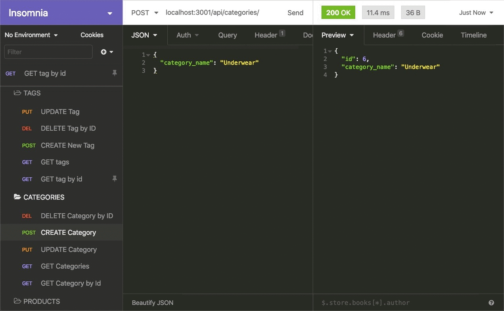
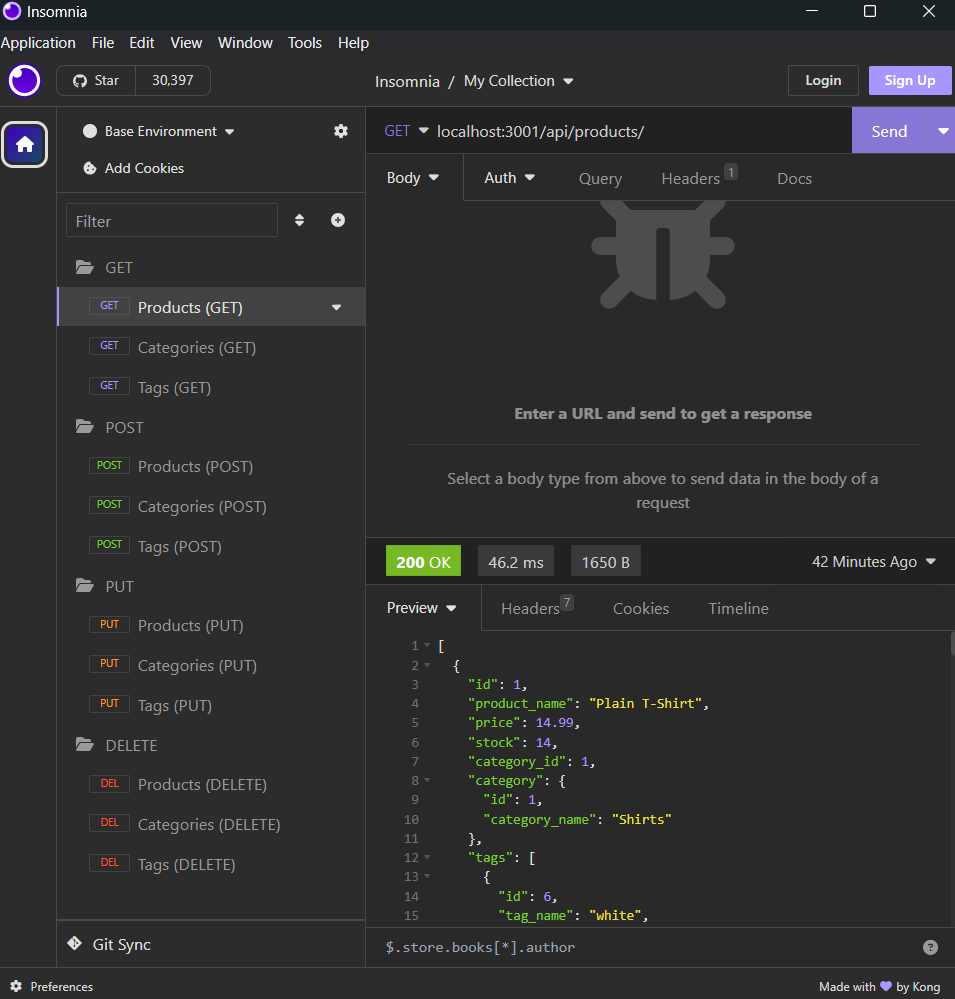
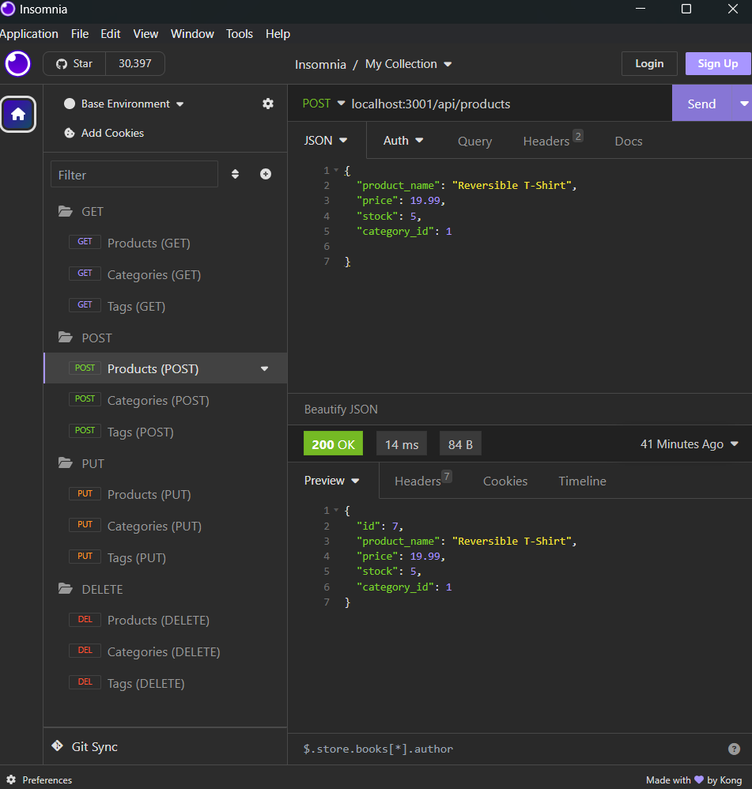
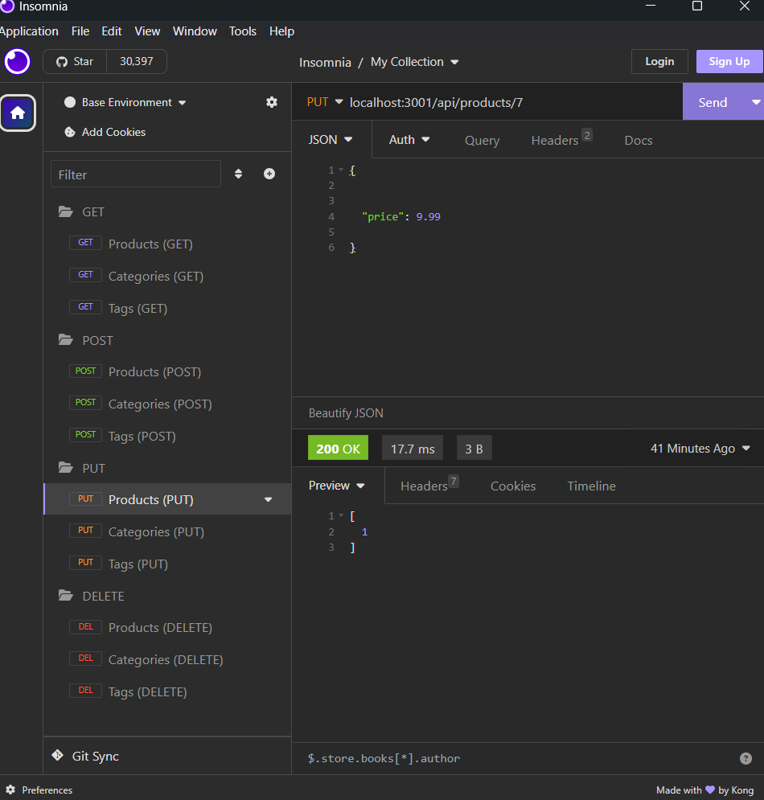
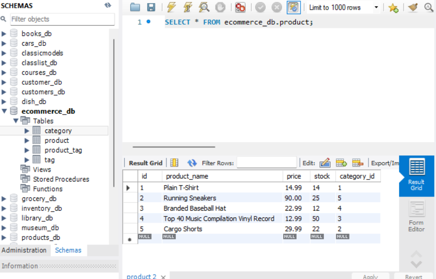

# E-Commerce BackEnd : (ORM) Object-Relational Mapping

## My Task

The electronics industry has been steam rolling through businesses and consumers in many ways. One of the more impactful ways would certainly have to be **e-commerce**, also known as Internet retail. Online buying and selling, the business that has been estimated to have brought in a grand total of about $2.54 trillion in US currency, is without a doubt a booming industry. This stat has been sourced from the United Nations Conference on Trade and Development, which should say a lot. E-commerce platforms like Shopify and WooCommerce provide convenient services to businesses of all sizes and this is due to the well planned out and efficiently executed architecture of their platforms.

My task was to build the back end for an e-commerce site by modifying starter code. I have used Sequelize by configuring a working Express.js API to interact with a MySQL database.

Because this application is a back end technology it will not be deployed for this portion of development. With that being said I have recorded a walkthrough video in order to demonstrate the functionality of this creation. 

## User Story

```md
AS the head of a internet retail company
I WANT to power my e-commerce website with a back end that utilizes the latest technologies
SO THAT our competition is not out ahead of us and we can make a lasting impression
```

## Acceptance Criteria

```md
GIVEN a functional Express.js API
WHEN I give my credentials which include a database name, MySQL username, and MySQL password to my .env file
THEN I am connected to a database using Sequelize after I drop the database on MySQL Workbench
WHEN I run my schema and seed commands
THEN the database is populated with the test data 
WHEN I invoke the application with the proper command
THEN my server starts and the Sequelize models are synced to the MySQL database
WHEN in Insomnia I open the API routes that I have stored inside of folders and I see GET, POST, PUT, and DELETE routes
THEN upon opening those folders I see routes associated with my categories, products, and tags
THEN the data is for each of these displays as JSON format 
WHEN I test the API I am successfully hitting the ending that allow me to retrieve, create, update, and delete data within the database 
```

### Mock-Up

The following animation was provided to me to illustrate the application's GET routes to return all categories, all products, and all tags being tested in Insomnia:


The following animation illustrates the application's GET routes to return a single category, a single product, and a single tag being tested in Insomnia:


The following animation illustrates the application's POST, PUT, and DELETE routes for categories being tested in Insomnia:



My walkthrough video also illustrates the GET, POST, PUT, and DELETE routes for products and tags being tested in Insomnia.

## Getting Started

This Challenge required a video submission. So I have referred to the [Fullstack Blog Video Submission Guide](https://coding-boot-camp.github.io/full-stack/computer-literacy/video-submission-guide) for additional guidance on creating my video.

I needed to use the [MySQL2](https://www.npmjs.com/package/mysql2) and [Sequelize](https://www.npmjs.com/package/sequelize) packages to connect the Express.js API to a MySQL database and the [dotenv](https://www.npmjs.com/package/dotenv) package to use environment variables to store sensitive data. See code to view and understand how I utilized these tools.

You will also see that I incorporated a `schema.sql` file in the `db` folder to create my database with MySQL shell commands. Environment variables were used to store sensitive data like MySQL username, password, and database name.

### Database Models

The following section is here to show how I was able to structure my models, this includes the template I followed to reach requirements listed for each model:

* `Category`

  * `id`

    * Integer.
  
    * Doesn't allow null values.
  
    * Set as primary key.
  
    * Uses auto increment.

  * `category_name`
  
    * String.
  
    * Doesn't allow null values.

* `Product`

  * `id`
  
    * Integer.
  
    * Doesn't allow null values.
  
    * Set as primary key.
  
    * Uses auto increment.

  * `product_name`
  
    * String.
  
    * Doesn't allow null values.

  * `price`
  
    * Decimal.
  
    * Doesn't allow null values.
  
    * Validates that the value is a decimal.

  * `stock`
  
    * Integer.
  
    * Doesn't allow null values.
  
    * Set a default value of `10`.
  
    * Validates that the value is numeric.

  * `category_id`
  
    * Integer.
  
    * References the `Category` model's `id`.

* `Tag`

  * `id`
  
    * Integer.
  
    * Doesn't allow null values.
  
    * Set as primary key.
  
    * Uses auto increment.

  * `tag_name`
  
    * String.

* `ProductTag`

  * `id`

    * Integer.

    * Doesn't allow null values.

    * Set as primary key.

    * Uses auto increment.

  * `product_id`

    * Integer.

    * References the `Product` model's `id`.

  * `tag_id`

    * Integer.

    * References the `Tag` model's `id`.

    ### Associations

For this assignment I executed association methods on my Sequelize models to create the following relationships between them:

* `Product` belongs to `Category`, and `Category` has many `Product` models, as a category can have multiple products but a product can only belong to one category.

* `Product` belongs to many `Tag` models, and `Tag` belongs to many `Product` models. Allow products to have multiple tags and tags to have many products by using the `ProductTag` through model.

> **Important** I have made sure to set up foreign key relationships that match the columns created in the respective models.

### API Routes Performing RESTful CRUD Operations

The unfinished routes in `product-routes.js`, `tag-routes.js`, and `category-routes.js` that perform create, read, update, and delete operations using my Sequelize models have been filled out to completion.

> **Important** The mini-project code was a big inspiration for me in terms of syntax that helped me throughout the challenge

### Database Seeded

After creating the models and routes, I ran `npm run seed` to seed data to my database so that I could ensure that testing my routes would show accurate results.

### Syncing Sequelize to the Database on Server Start

Inside of `server.js` in order to sync the Sequelize models to the MySQL database on server start, I have created the code needed for it to execute properly.

## Review

This section is here to highlight the required elements needed for review:

* My walkthrough video demonstrating the functionality of the application:

Refer to this [Walkthrough Video](https://drive.google.com/file/d/1HO7iTuOAjod1iqyJ49M3fXk5Qiz573BF/view) to view the functionality of this application
    

* The URL to my ObjectRelationalMapping GitHub repository, with a unique name and this README to describe the project:

Refer to this link [GitHub Repository](https://github.com/TheKhalidGibson/ObjectRelationalMapping) to view and explore the GitHub repo for this assignment

## Screenshots

The following images reflect the functionality and final results of development for this command-line application:
    






